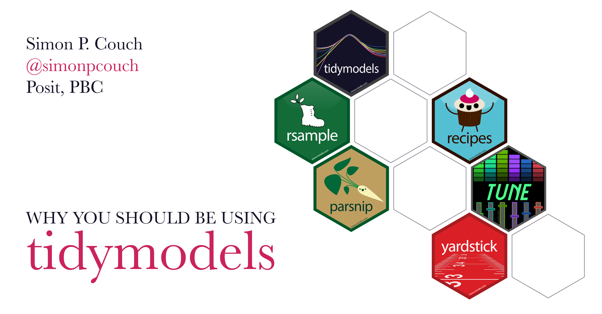

This repository contains source code and slides for the talk "Why you should be using tidymodels" at UW-Madison in November 2023.

* The **slides** for the talk are available [here](https://simonpcouch.github.io/tidymodels-uw-2023).
* The **example notebook** modeling flight delays out of Madison, WI is [here](https://simonpcouch.github.io/tidymodels-uw-2023/example).🛩

To learn more about data science and machine learning with R,

- Data science with the tidyverse: [r4ds.hadley.nz](r4ds.hadley.nz)
- Machine learning with tidymodels: [tmwr.org](tmwr.org)
- More example notebooks with tidymodels: [tidymodels.org](tidymodels.org)

----

In this repository,

-   `index.qmd` contains the source code for the slides. The slides use images in the `/figures` directory.
-   `/example` contains the source code for the example notebook.
-   `/docs` is auto-generated from `/example/index.qmd` and is post-processed with `downlit.R`. Content in that folder is likely unhelpful for a human reader, and is better viewed at the links above. :)
